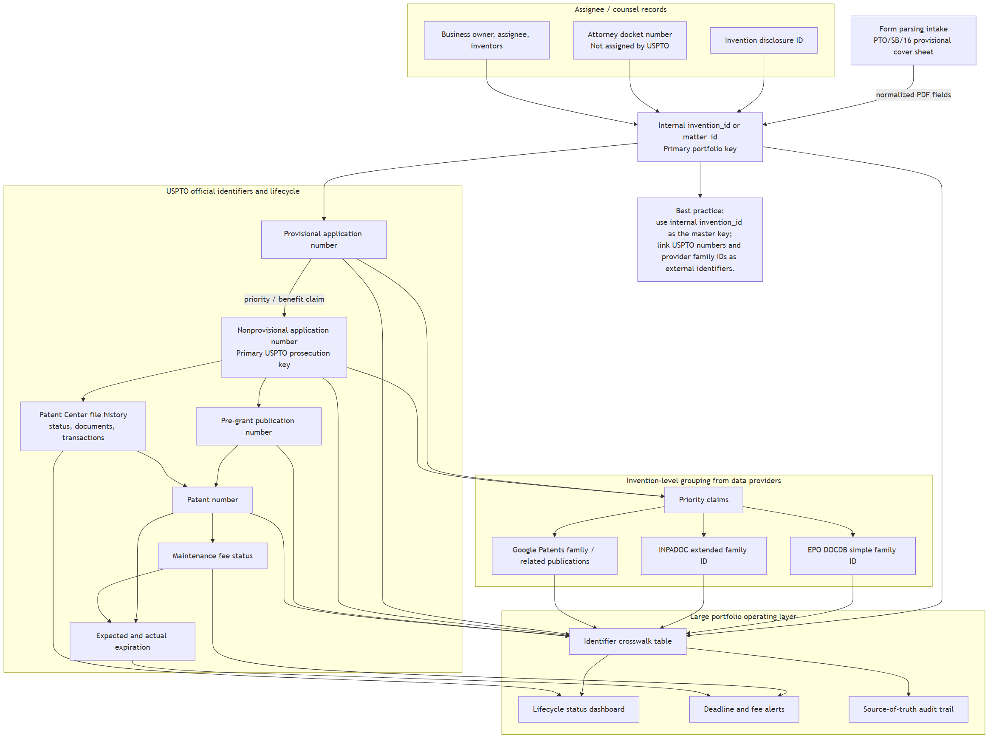

# Identifier Strategy

There is no single public USPTO invention-level ID that is independent of provisional status, application status, publication status, or granted patent status and that can serve as a universal master key across the whole patent lifecycle.

The practical strategy is to create an internal master identifier and attach all public and private identifiers to it.

## Identifier Strategy Diagram

## Master Key

Use the internal `invention_id` / `matter_id` as the master portfolio key.

Recommended distinction:

- `invention_id`: groups the invention concept or disclosure across related filings.
- `matter_id`: tracks a specific legal or operational matter in the portfolio system.

For a small prototype, one matter can start with both IDs. For a large portfolio, a single invention may have multiple matters, including provisionals, nonprovisionals, continuations, divisionals, PCT applications, foreign filings, grants, reissues, or post-grant proceedings.

## USPTO Official Identifiers

USPTO identifiers are authoritative for U.S. lifecycle records, but each applies to a specific stage or record type.

Common official identifiers:

- provisional application number
- nonprovisional application number
- publication number
- patent number
- customer number, confirmation number, and other filing context if later modeled

The application number is the core prosecution key before grant. The publication number identifies the published application. The patent number identifies the granted patent. These numbers are linked, but none is a stage-independent invention master key.

## PCT Identifier

The PCT number is an official international application identifier. It should be linked to the internal invention or matter record when a PCT application claims priority to, or otherwise relates to, the same invention.

## Attorney Docket Number

The attorney docket number is a counsel or assignee reference. It is useful for coordination, correspondence, and docketing, but it is not assigned by the USPTO and should not be treated as an official USPTO identifier.

## Invention Disclosure ID

The invention disclosure ID is usually assigned inside the company, university, or assignee workflow before or during patent intake. It is often the earliest durable business reference for an invention.

For portfolio-scale work, the disclosure ID can be the bridge between R&D intake and legal filing records.

## Patent Family Identifiers

Patent family identifiers group related documents. They are useful for portfolio analysis and discovery, but they are provider constructs.

Examples:

- EPO DOCDB simple family ID
- INPADOC extended family ID
- Google Patents family or related-publication grouping
- commercial provider family IDs

Family definitions can differ by provider. Simple families, extended families, continuations, divisionals, foreign counterparts, and priority chains may not align exactly.

## Google Patents And Google Scholar Style Tracking

Google Patents is useful for finding publications, grants, family members, citations, classifications, prior art, and related literature. Google Scholar can surface non-patent literature and citation signals.

These sources are useful for discovery and research. They should not be the legal source of truth for U.S. prosecution status, maintenance status, or file history.

## Large Portfolio Application

For large patent portfolios, maintain an identifier crosswalk table with at least:

- internal invention ID
- internal matter ID
- invention disclosure ID
- attorney docket number
- provisional application number
- nonprovisional application number
- publication number
- patent number
- PCT number
- priority claim references
- EPO DOCDB family ID
- INPADOC family ID
- Google Patents family or URL reference
- assignee
- inventor set
- source system
- confidence or review status

## Source-Of-Truth Rule

- Use internal IDs for portfolio identity and joins.
- Use USPTO records for U.S. legal status, publications, grants, file history, and maintenance status.
- Use PCT/WIPO records for PCT lifecycle facts.
- Use provider family IDs for grouping and discovery.
- Use attorney docket and disclosure IDs for internal workflow alignment.

No external identifier should replace the internal master key.
