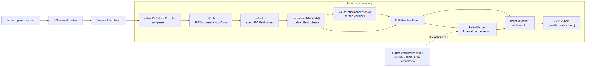
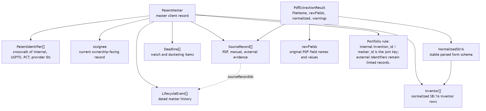
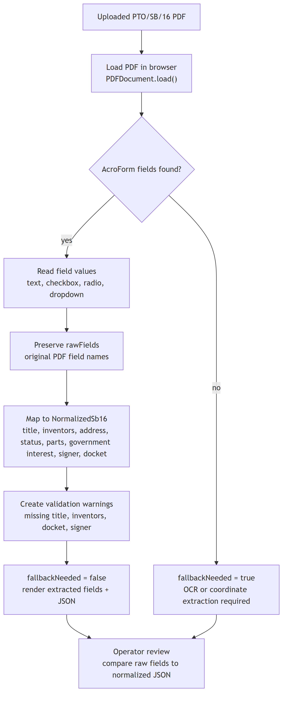
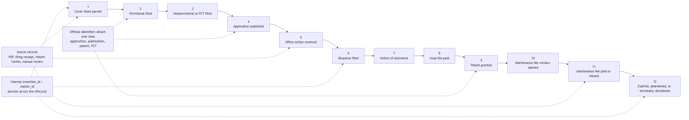
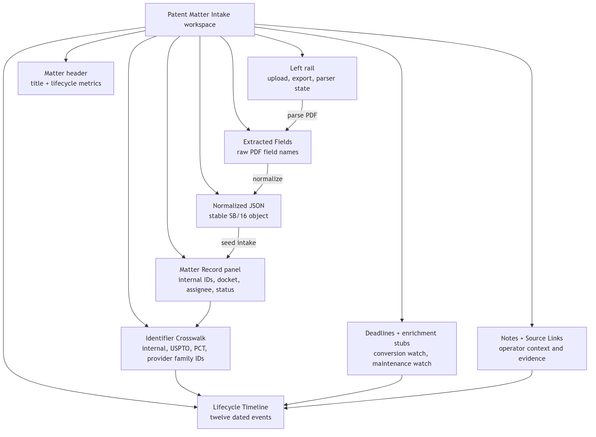
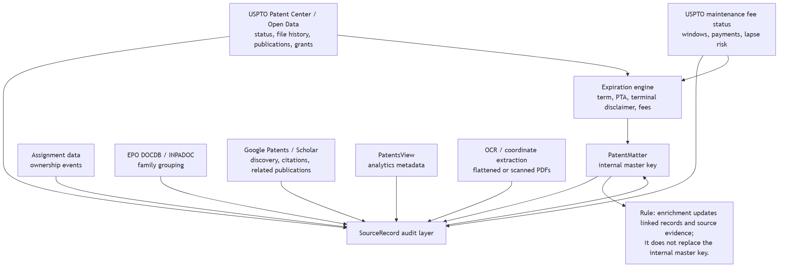

# Documentation Index

This directory documents the client-side patent intake and lifecycle tracking prototype.

## Core Documents

- [README.md](./README.md): overview, purpose, audience, scope, and local run commands.
- [architecture.md](./architecture.md): client architecture and data flow from PDF upload through JSON export.
- [data-model.md](./data-model.md): TypeScript model definitions and source-of-truth rules.
- [sb16-form-parsing.md](./sb16-form-parsing.md): AcroForm extraction, normalization, blank-form handling, and fallbacks.
- [patent-lifecycle.md](./patent-lifecycle.md): lifecycle events from provisional intake through expiration or abandonment.
- [identifier-strategy.md](./identifier-strategy.md): internal master IDs, USPTO identifiers, family identifiers, and portfolio use.
- [ui-guide.md](./ui-guide.md): UI sections and operator workflow.
- [validation-and-quality.md](./validation-and-quality.md): validation rules, auditability, export checks, and known limits.
- [future-enrichment.md](./future-enrichment.md): future external data integrations and enrichment paths.
- [implementation-notes.md](./implementation-notes.md): source files, parser utilities, state management, build notes, and dependencies.

## Diagram Assets

- 
- 
- 
- 
- 
- 
- 
- 

- [architecture_data_flow.mmd](./architecture_data_flow.mmd): editable architecture data-flow source.
- [architecture_data_flow.png](./architecture_data_flow.png): rendered architecture data-flow diagram.
- [data_model_relationships.mmd](./data_model_relationships.mmd): editable data-model relationship source.
- [data_model_relationships.png](./data_model_relationships.png): rendered data-model relationship diagram.
- [sb16_parser_decision_tree.mmd](./sb16_parser_decision_tree.mmd): editable parser decision-tree source.
- [sb16_parser_decision_tree.png](./sb16_parser_decision_tree.png): rendered parser decision-tree diagram.
- [lifecycle_timeline.mmd](./lifecycle_timeline.mmd): editable lifecycle timeline source.
- [lifecycle_timeline.png](./lifecycle_timeline.png): rendered lifecycle timeline diagram.
- [ui_surface_map.mmd](./ui_surface_map.mmd): editable UI surface map source.
- [ui_surface_map.png](./ui_surface_map.png): rendered UI surface map.
- [validation_quality_flow.mmd](./validation_quality_flow.mmd): editable validation and quality source.
- [validation_quality_flow.png](./validation_quality_flow.png): rendered validation and quality flow.
- [future_enrichment_roadmap.mmd](./future_enrichment_roadmap.mmd): editable enrichment roadmap source.
- [future_enrichment_roadmap.png](./future_enrichment_roadmap.png): rendered enrichment roadmap.
- [patent_portfolio_lifecycle_identifiers.mmd](./patent_portfolio_lifecycle_identifiers.mmd): editable Mermaid diagram source.
- [patent_portfolio_lifecycle_identifiers.png](./patent_portfolio_lifecycle_identifiers.png): high-resolution rendered diagram.

## Reading Order

1. Start with [README.md](./README.md).
2. Read [identifier-strategy.md](./identifier-strategy.md) before designing portfolio storage.
3. Read [data-model.md](./data-model.md) and [architecture.md](./architecture.md) before editing code.
4. Read [sb16-form-parsing.md](./sb16-form-parsing.md) before modifying parser behavior.
5. Read [future-enrichment.md](./future-enrichment.md) before connecting external data sources.
