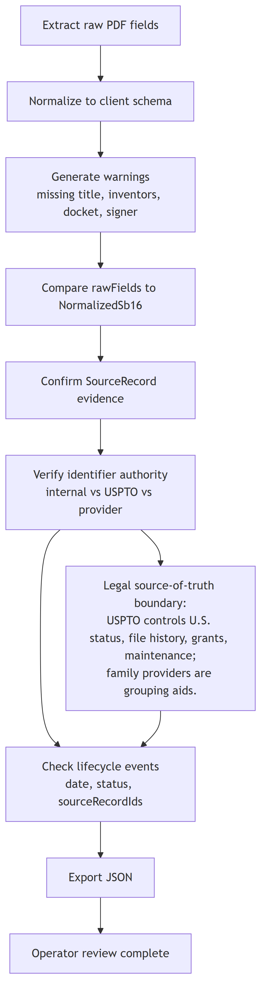

# Validation And Quality

The first version implements lightweight validation focused on intake completeness and auditability.

## Validation Flow

## Current Validation Rules

`validateNormalizedSb16()` warns when:

- invention title is missing
- no inventors were extracted
- attorney docket number is missing
- signer name is missing

These warnings are shown in the Parser State card and exported with the parser result.

## Required Review Fields

For an operator to treat an intake record as reviewed, these fields should be checked:

- invention title
- inventor list
- correspondence address
- entity status
- application parts
- government-interest fields
- signer name
- signature date
- attorney docket number
- internal invention ID
- matter ID
- source record

## Raw Versus Normalized Checks

The exported JSON intentionally includes both:

- `extraction.rawFields`
- `extraction.normalized`

Quality review should compare these to verify:

- field names match the expected form version
- values were not dropped during normalization
- checkbox values were interpreted correctly
- blank values are truly blank, not parser failures
- inventor rows were filtered correctly

## Source-Record Auditability

Each uploaded PDF creates a `SourceRecord` with:

- file label
- source type `pdf`
- capture timestamp
- raw field names

Lifecycle events can link to source records through `sourceRecordIds`. The first parsed PDF is linked to the `provisional_cover_sheet_parsed` event.

For production use, source records should include immutable file hashes, storage references, user identity, and review status.

## Export Checks

Before relying on an exported JSON file, verify:

- `matter.inventionId` is populated
- `matter.matterId` is populated
- `matter.identifiers` contains the expected internal and external IDs
- official identifiers are not confused with provider family IDs
- lifecycle event statuses match the actual matter state
- source records support completed events
- warnings are reviewed

## Known Limits

- No OCR or coordinate extraction.
- No external API enrichment.
- No persistent local storage.
- No authentication or user attribution.
- No file hashing.
- No automatic patent-term calculation.
- No automatic maintenance-fee calculation.
- No repeated prosecution event model beyond the fixed twelve rows.
- No distinction yet between application families, matters, and filings beyond the initial identifier crosswalk.
- No legal verification of status, term, ownership, or deadlines.

## Quality Bar For Future Changes

Future parser or lifecycle changes should include:

- test PDFs for blank, filled, flattened, and scanned cases
- mapping tests for known SB/16 field names
- validation tests for required fields
- exported JSON fixture comparisons
- source-record checks
- explicit source-of-truth handling for external enrichment
